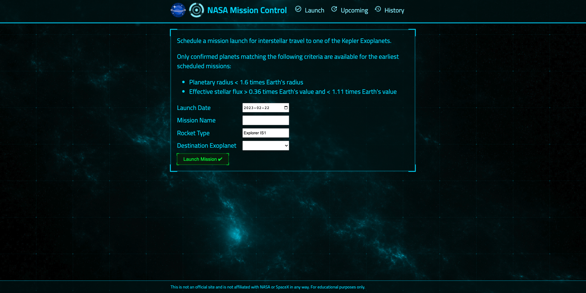

# **NASA mission control**
<br> A simulation of rocket launching missions that NASA tends send to habitable planets. 
<br>
## **Why this project**

As Software Engineer, I would like to build application helping people to learn different planet and have a sense of accomplishment when a simulated mission successfully launched.

## **How to run the project**

- Dev environment:
    - Front end:
    ```
    # From root directory of this project
    npm run client
    ```
    go to [localhost](http://localhost:3000)
    - Backend:
    ```
    # From root directory of this project
    npm run server
    ```
    go to [localhost](http://localhost:3004)
    - Both same time:
    ```
    # From root directory of this project
    npm run watch
    ```
- Prod environment:
    - run deployed version:
    ```
    # From root directory of this project
    npm run deploy
    ```
    go to [localhost](http://localhost:3004)

- Testing:
    - run testing:
    ```
    #TODO
    ```

- Postman docs: Link is coming 


- Demos:
    
